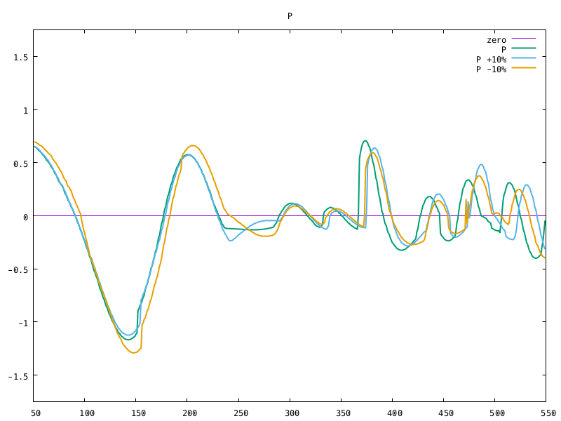
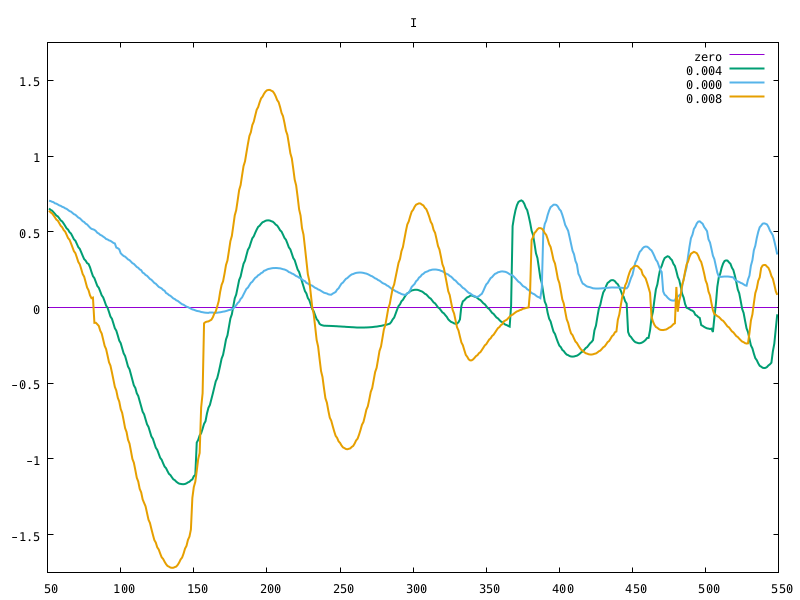
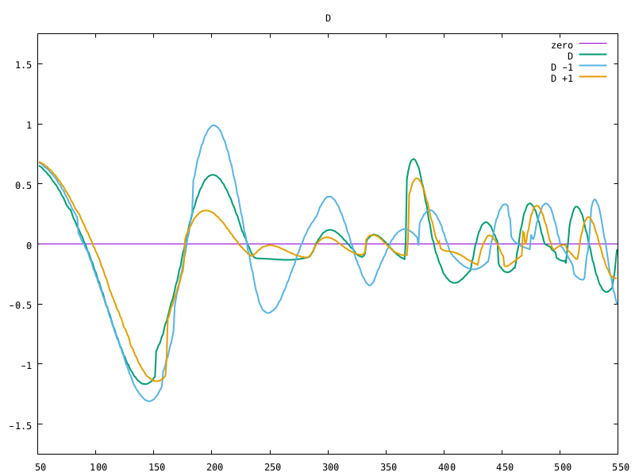

# PID Controller Project
[](http://www.udacity.com/drive)
[](https://circleci.com/gh/sgalkin/CarND-T2P4)

---

## Overview
This project implements controlling application for Udacity self-driving car
simulator using PID controller mechanism.

The project implements _"twiddle"_ parameters tuning algorithm as well.

**Project objective**: No tire may leave the drivable portion of the track
surface. The car may not pop up onto ledges or roll over any surfaces that would otherwise be considered unsafe (if humans were in the vehicle).

## Demo
[PID throttle](https://vimeo.com/250195947)

`./pid -p 0.195405 -i 0.004 -d 3.28759 --tKp 0.45372 --tKi 0 --tKd 0.941861`

[Constant throttle](https://vimeo.com/250195946)

`./pid -p 0.195405 -i 0.004 -d 3.28759 -c 0.4`

---

## Usage
```sh
Usage:
  pid [options]
Available options:
      --tKd      throttle PID Kd
      --tKi      throttle PID Ki
  -c, --tC       constant throttle
  -i, --sKi      steering angle PID Ki
  -p, --sKp      steering angle PID Kp
      --tKp      throttle PID Kp
  -d, --sKd      steering angle PID Kd
  -t, --twiddle  enable twiddle mode
  -h, --help     print this help screen
```

### Twiddle mode
```sh
./pid -t
```

In order to activate "twiddle" mode the only `-t` option should be passed via
command line.

### Operational mode
```sh
./pid -p<Kp> -i<Ki> -d<Kd> (-c<C> | --tKp<tp> --tKi<ti> --tKd<kd>)
```

In order to configure operational mode one might choice between constant
throttle (`--tC`) and throttle PID controller (`--tKp`, `--tKi`, and `--tKd`).
Steering angle always controlled by PID (`--sKp`, `--sKi`, and `--sKd`).

## Dependencies
### Runtime
* [Term 2 Simulator](https://github.com/udacity/self-driving-car-sim/releases)

### Tools
* `cmake` >= 3.5
  * All OSes: [click here for installation instructions](https://cmake.org/install/)
* `make` >= 4.1 (Linux, Mac), 3.81 (Windows)
  * Linux: make is installed by default on most Linux distros
  * Mac: [install Xcode command line tools to get make](https://developer.apple.com/xcode/features/)
  * Windows: [Click here for installation instructions](http://gnuwin32.sourceforge.net/packages/make.htm)
* `gcc/g++` >= 5.4, clang
  * Linux: gcc/g++ is installed by default on most Linux distros
  * Mac: same deal as make - [install Xcode command line tools](https://developer.apple.com/xcode/features/)
  * Windows: recommend using [MinGW](http://www.mingw.org/)

### Libraries not included into the project
* [`uWebSocketIO`](https://github.com/uWebSockets/uWebSockets) == v0.13.0
  * Ubuntu/Debian: the repository includes `install-ubuntu.sh` that can be used to set
    up and install `uWebSocketIO`
  * Mac: the repository includes `install-mac.sh` that can be used to set
    up and install `uWebSocketIO`
  * Windows: use either Docker, VMware, or even [Windows 10 Bash on     Ubuntu](https://www.howtogeek.com/249966/how-to-install-and-use-the-linux-bash-shell-on-windows-10/)

### Libraries included into the project
* [`JSON for Modern C++`](https://github.com/nlohmann/json) - JSON parser
* [`Catch2`](https://github.com/catchorg/Catch2) - Unit-testing framework
* [`ProgramOptions.hxx`](https://github.com/Fytch/ProgramOptions.hxx) - Single-header program options parsing library for C++11

## Build
0. Clone this repo.
1. `mkdir build`
2. `cd build`
3. `cmake .. -G "Unix Makefiles"`
4. `make`
5. `make check # -- optional`

## Protocol
The project uses `uWebSocketIO` request-response protocol in communicating with the simulator.

_INPUT_: values provided by the simulator to the c++ program
```json
{
  "cte": "current cross track error",
  "speed": "current speed",
  "steering_angle": "current steering angle"
}
```

_OUTPUT_: values provided by the c++ program to the simulator
* `steer` - instruct simulator to adjust steering angle and speed
```json
{
  "steering_angle": "steering angle evaluated on current iteration [-1..1]",
  "throttle": "throttle evaluated on current iteration [-1..1]"
}
```
* `reset` - forces simulator to reset state

## Model
The project uses set of two PID controllers to update steering angle and throttle.

### PID
PID (proportional–integral–derivative) is wildly used control technic.
PID controller continuously evaluates difference between current state and
reference (desired) state and applies a correction which consists of
* proportional - _the main force to achieve convergence to desired state_
  
  The plot shows how choice of _Kp_ affects the error over time. Choosing smaller
  value of _Kp_ (orange line) leads to longer convergence. On other hand higher
  value of _Kp_ gives an opportunity to converge faster (around step 250), but
  might lead to bigger error (around step 475).

* integral - _fights against potential systematic bias_
  
  The plot shows there is a systematic bias presents in the system. Blue line
  (_Ki_ == 0) oscillates around small positive value. Choosing small positive
  value (green curve) as _Ki_ allows get rid of it. The large value
  (orange curve) might increase overall error.

* derivative - _fights against oscillation around desired state_
  
  Proper choice of the _Kd_ allows controller to reduce oscillation.

### Steering Angle Controller
* Input - pure simulator cross track error value
* Parameters - _Kp_, _Ki_, _Kd_
* Output - truncated to be in range _[-1 .. 1]_

### Throttle Controller
* Input - magnitude of cross track error shifted by pre-defined value
* Parameters - _Kp_ and _Kd_ (so in fact it's PD-controller)
* Output - truncated to be in range _[-1e-2 .. 1]_

Magnitude of the cross track error was taken as an input since there is no
difference for the controller if the car on the left, or on the right side of
the reference path.

The offset defines minimal cross track error magnitude to start braking.

Ki parameter was dropped to reduce the size of parameter space for tuning.
PID uses Ki in order to reduce an effect of systematic bias. Since magnitude is
used as the input for the controller there is no sense to keep track of
systematic bias. It could only be introduced by poor choice of offset value
(for now the assumption is the offset value is selected carefully).

### Tuning
Schema for tuning the hyperparameters
* Initial feasible solution was found. Fortunately, the value from lesson
  worked as a feasible solution at constant throttle of _0.3_
* Twiddle approach was used to tune feasible solution from _(1)_.
* Score was calculated from the whole lap

Since twiddling is **very** time consuming
* simulator provides one measurement each _~0.03_ seconds
* the lap is _~0.85_ miles long
* simulation time for 1 lap at avg. speed of 45 mph _~60_ seconds
* Each set of parameters need to be simulated

The following adjustment was made in scoring routine to achieve keep-feasible
and fail-fast goals
1. Negative _Kp_ value for both controllers treated as failure
2. Score was counted only till currently known best score
3. Velocity below threshold for pre-defined number of measurements treated as failure
4. Distance below threshold after pre-defined number of measurements treated as failure
5. _Ki_ parameter for throttle controller was dropped

## TODO
1. Try to use different parameters tuning technic
2. Try to use PID instead of PD to control throttle
3. Try different input for throttle controller (ie use current angle and/or speed)
4. Normalize parameters to be on the same scale before running twiddle
